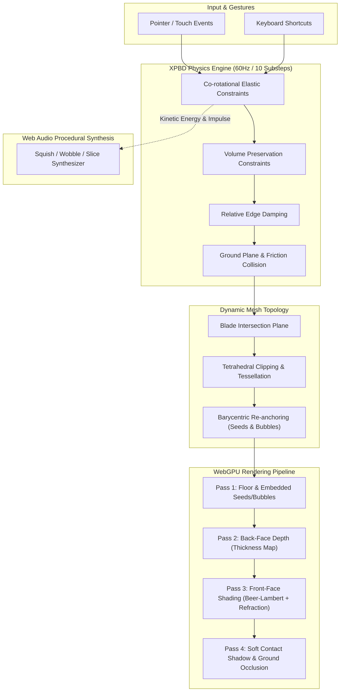

> [!NOTE]
> **[Melon Jelly WebGPU is live](https://jojin1709.github.io/melon-jelly-webgpu/):** Experience real-time XPBD soft-body physics, dynamic mesh cutting, volumetric Beer–Lambert refraction, and procedural audio synthesis — all in **one self-contained HTML file** with zero external dependencies.

<div align="center">

# 🍉 Melon Jelly

### Real-Time Soft-Body Physics & Volumetric Shaders in Pure WebGPU

An interactive 3D watermelon-jelly slice you can stretch, poke, wobble, and slice into pieces with a knife right in your browser.

[](https://jojin1709.github.io/melon-jelly-webgpu/)
[](https://caniuse.com/webgpu)
[](LICENSE)
[](https://www.linkedin.com/in/jojin-john/)

<br>

**[https://jojin1709.github.io/melon-jelly-webgpu/](https://jojin1709.github.io/melon-jelly-webgpu/)**

<sub>Single self-contained HTML file • Zero dependencies • Runs client-side in any WebGPU-capable browser.</sub>

</div>

> [!TIP]
> **Quick Keyboard Shortcuts:** Press <kbd>H</kbd> for Hand tool, <kbd>K</kbd> for Knife, <kbd>C</kbd> to make an angled cut, <kbd>Z</kbd> to undo, <kbd>D</kbd> for Night Studio mode, and <kbd>Space</kbd> to pause the physics simulation.

---

## Table of Contents

- [What is Melon Jelly?](#what-is-melon-jelly)
  - [Why Melon Jelly Exists](#why-melon-jelly-exists)
  - [Why WebGPU and XPBD?](#why-webgpu-and-xpbd)
  - [The Single-File Philosophy](#the-single-file-philosophy)
- [Interactive Controls & Shortcuts](#interactive-controls--shortcuts)
- [🤖 Prompt to Build with Claude](#-prompt-to-build-with-claude)
- [Key Features & Capabilities](#key-features--capabilities)
  - [Soft-Body Simulation](#soft-body-simulation)
  - [Dynamic Knife Slicing](#dynamic-knife-slicing)
  - [Physically Inspired Jelly Rendering](#physically-inspired-jelly-rendering)
  - [Interactive Audio Synthesis](#interactive-audio-synthesis)
- [Flavours & Texture Presets](#flavours--texture-presets)
- [System Architecture](#system-architecture)
  - [Pipeline Overview](#pipeline-overview)
  - [How Dynamic Slicing Works](#how-dynamic-slicing-works)
- [Browser Compatibility](#browser-compatibility)
- [Roadmap](#roadmap)
- [License](#license)
- [Author & Acknowledgements](#author--acknowledgements)
- [Common Questions (FAQ)](#common-questions)

---

## What is Melon Jelly?

**Melon Jelly** is a technical demonstration of real-time continuum mechanics and advanced graphics inside modern web browsers. It simulates an elastic, gelatinous slice of watermelon with a stiff rind and soft translucent flesh containing embedded seeds and air bubbles.

You can grab and tug it with a hand tool, flick it to watch it jiggle, or drag a knife across it to slice it into smaller, independently simulated soft-body pieces in real time.

<a id="why-melon-jelly-exists"></a>
<details>
<summary><strong>Why Melon Jelly Exists</strong></summary>

Most web 3D demos rely on rigid bodies, baked animations, or heavy third-party physics engines (like Ammo.js or Rapier) running inside complex npm build setups. 

Melon Jelly was created to demonstrate what modern browsers can accomplish natively using **pure WebGPU and mathematical first principles**:
- Real volumetric soft-body elasticity (XPBD) running at 600 substeps/second.
- Real-time tetrahedral mesh clipping and topological reconstruction when cut.
- High-end optical effects (refraction, absorption, thickness estimation, Fresnel, GGX highlights) written in custom WGSL shaders.
- Procedural audio synthesized from scratch with the Web Audio API.

</details>

<a id="why-webgpu-and-xpbd"></a>
<details>
<summary><strong>Why WebGPU and XPBD?</strong></summary>

- **WebGPU** brings low-overhead GPU access, modern compute and render pipelines, and first-class WGSL shading. This enables two-pass front/back depth peeling to compute ray traversal thickness through translucent jelly.
- **Extended Position Based Dynamics (XPBD)** replaces traditional spring-mass penalty systems with unconditionally stable, constraint-based deformation. By separating stiffness from time-step duration, XPBD prevents explosive instabilities during aggressive grabbing and cutting.

</details>

<a id="the-single-file-philosophy"></a>
<details>
<summary><strong>The Single-File Philosophy</strong></summary>

The entire application is contained in a **single `index.html` file**:
- **0 dependencies:** No Three.js, Babylon.js, Webpack, Vite, or npm modules.
- **Instant load:** Download and double-click to run in any WebGPU-capable browser.
- **Preserved forever:** Completely decoupled from changing frontend toolchains and packaging ecosystem shifts.

</details>

---

## Interactive Controls & Shortcuts

| Input | Action | Description |
|:---:|:---|:---|
| <kbd>H</kbd> | **Hand Tool** | Grab, stretch, pull, or flick any part of the jelly |
| <kbd>K</kbd> | **Knife Tool** | Draw a cut line across any piece to slice it |
| <kbd>C</kbd> | **Quick Cut** | Instant slice along current cut angle (`Shift+C` reverses angle) |
| <kbd>[</kbd> / <kbd>]</kbd> | **Rotate Blade** | Rotate knife cut angle in 15° increments |
| <kbd>Z</kbd> | **Undo Cut** | Revert the last slice back into its parent piece |
| <kbd>N</kbd> | **Nudge** | Apply a sharp impulse to make the jelly jiggle |
| <kbd>R</kbd> | **Reset** | Restore the original uncut watermelon wedge |
| <kbd>Space</kbd> | **Pause** | Freeze / resume physical simulation |
| <kbd>O</kbd> | **Auto-Orbit** | Smooth cinematic camera rotation around the specimen |
| <kbd>D</kbd> | **Night Studio** | Toggle high-contrast dark studio lighting |
| <kbd>P</kbd> | **Save PNG** | Snapshot high-resolution screenshot of current frame |

### Mouse & Touch Gestures
- **Hand Mode:** Click/touch and drag to pull. Scroll wheel or two-finger pinch to twist. Quick tap to flick.
- **Knife Mode:** Drag a line across the slice and release to drop the blade.
- **Camera:** Right-click drag or middle-click drag to orbit and examine the cut surfaces.


---

## 🤖 Prompt to Build with Claude

Want to generate, adapt, or build this entire specimen using **Claude** (such as Claude 3.5 / 3.7 Sonnet or Claude Opus)? Below is the complete prompt and technical specification used to build this single-file WebGPU & XPBD soft-body application:

> [!TIP]
> **Prompting Claude:** Copy and paste the prompt below directly into Claude with artifacts enabled.

```text
Build an interactive 3D "Melon Jelly" specimen as ONE self-contained HTML file
(no external scripts or images; it must work when opened from a local file).

REFERENCES (attached with this message)
- Photos of real melon jelly / gummy: match the see-through depth, colour
  gradient (deep red core, pale edge), shine, and the rind and seed placement.
- [Describe the wobble clip]: e.g. "settles in about 1.5 seconds, 3 to 4 visible
  bounces, soft and slow, not rubbery." Match this for the physics feel.
- Style screenshots: copy [layout / title font / panel style / spacing].
  Ignore [background / colours / anything else you don't want].
  Match level: inspired by / as exact as possible.
- Colour palette: [hex codes, or "watermelon red, pale green, dark green rind"].
- Logo (optional): embed it small, inline as a data URI.
- Sound reference: [describe it, e.g. "wet squelch, short, low, a bit sticky"].
- Links to check: [paste any URLs I should read and match].
- Do NOT do: [things you've seen elsewhere that felt wrong].

LOOK
- A translucent watermelon-jelly slice (wedge with a rind) on a soft studio floor.
- Calm editorial style: serif italic title "Melon Jelly.", small caps labels,
  warm grey background (#E2DFDA), thin hairline borders, no gradients or glow.
- Caption: "A slice of summer. A little wobble. Too soft to share."
- Credit line top-left under the caption: "Developed by JOJIN JOHN" linking to
  https://www.linkedin.com/in/jojin-john/ (opens in a new tab).
- Support a Night studio mode (dark background, light text).

TECH
- WebGPU + WGSL, no libraries. Soft body: tetrahedral mesh, XPBD, fixed 60 Hz step.
- Rind about 3x stiffer than flesh; damping on relative edge velocity only.
- Seeds and air bubbles stay attached to the flesh (barycentric skinning).
- Jelly look: refraction, thickness-based absorption, Fresnel reflection,
  soft shadows, tone mapping.
- Show a friendly fallback card (with a small drawing and browser advice)
  when WebGPU is not available.

INTERACTION
- Hand tool: grab any part and pull; scroll or two fingers to twist;
  quick tap flicks a piece.
- Knife tool: draw a line across the slice; a knife lines up and cuts the jelly
  into convex pieces; pieces can be cut again (cap at 14 pieces).
- Keyboard: H hand, K knife, C cut (Shift+C horizontal), [ ] rotate cut angle,
  Z undo cut, N nudge, R reset, P save PNG, O auto-orbit, D night, Space pause.

CONTROL PANEL (right side on desktop, stacked under the scene on phones)
- Variety swatches, plus a custom colour picker.
- Texture presets: Gelatin, Mochi, Slime. Sliders: Firmness, Internal damping.
- Buttons: Give it a nudge, Reset, Pause, Undo cut, Cut up/down, Cut sideways,
  Save PNG, Record 6s (webm), Quality High/Low, Copy share link.
- Checkboxes: 1/4 speed, Show mesh, Sound, Low gravity, Slow-mo cuts,
  Ambient music, Auto-orbit, Night studio, Haptics. Volume slider.
- Live readouts: Mass, Volume, Kinetic energy, Pieces, cuts on slice and total.
- Collapsible "Inside the experiment" notes explaining the method.
- Panel must scroll inside its own box and never overlap the notes.
  Equal-width button rows, 2-column checkbox grid.

SOUND (WebAudio, no files)
- Grab: short wet squish. Release: low wobbling tone that fades.
- Cut: blade "shff" then a wet squelch and low thump. Undo: small pop.
- Optional soft ambient pad. Master volume and a mute toggle.

QUALITY RULES
- Respect prefers-reduced-motion. Visible focus outlines. 44px touch targets
  on phones. Labels on every control.
- Share link stores colour, firmness, damping, night mode in the URL hash.
- Wrap localStorage and clipboard use in try/catch.

DELIVERY
- Publish it as an artifact and also give me the downloadable .html.
- Keep the reply short: what you built, what you left out.
- Test the script syntax before publishing. If something can't fit, build the
  core well and list what you skipped.
```

---

## Key Features & Capabilities

### Soft-Body Simulation
- **Tetrahedral XPBD:** Volumetric mesh simulated at a fixed 60 Hz rate with 10 substeps per frame.
- **Heterogeneous Material Stiffness:** Watermelon rind is calibrated at **~3× the stiffness** of the soft inner flesh.
- **Volume Conservation:** Hydrostatic pressure constraints preserve total volume under compression and stretching.
- **Edge Damping:** Relative velocity damping dampens internal vibrations without slowing rigid body falls or spins.

### Dynamic Knife Slicing
- **Real-Time Splitting:** Generates fresh tetrahedral meshes on release when a blade plane intersects convex contours.
- **State Inheritance:** Split halves inherit particle velocity, barycentric weights, and internal strain from the parent.
- **Multi-Piece Support:** Slice pieces recursively into up to 14 independent soft bodies with mutual floor contact.
- **Interactive Undo:** History stack allows stepping back through cuts seamlessly.

### Physically Inspired Jelly Rendering
- **Volumetric Absorption:** Beer–Lambert exponential decay based on internal ray traversal distance.
- **Dual-Pass Depth Peeling:** Measures thickness between front-facing and back-facing geometry.
- **Refraction & Dispersion:** Ray bending with microfacet GGX specular highlights and procedural environment reflections.
- **Embedded Barycentric Anchors:** Seeds and micro-bubbles are permanently tied to surrounding tetrahedra.

### Interactive Audio Synthesis
- **Zero Audio Assets:** Procedural audio synthesis via Web Audio API.
- **Tactile Sound Effects:** Physics-driven wobbles, squishes, blade cuts, and elastic pops generated dynamically.
- **Optional Ambient Track:** Relaxing generative background soundscape with volume controls.

---

## Flavours & Texture Presets

| Flavour Variety | Color Profile | Seed Count | Aesthetics |
|:---|:---|:---:|:---|
| **Crimson** | Classic ruby-red flesh & emerald rind | High | Fresh summer watermelon |
| **Golden** | Sunny yellow flesh & bright rind | Moderate | Crisp golden honeydew hybrid |
| **Rosé** | Subtle pastel pink & soft mint | Low | Delicately translucent jelly |
| **Lime** | Zesty citrus green & deep rind | Low | Neon sour lime gelatin |
| **Ube** | Rich royal purple & dark peel | Moderate | Sweet taro / ube dessert |
| **Berry** | Deep dark berry red & violet peel | High | Rich wild fruit preserve |
| **Custom** | Hex Color Picker | User-defined | Personalized jelly creations |

### Texture Presets
- **Gelatin:** Balanced elasticity, high bounce, moderate compliance.
- **Mochi:** Dense, highly damped, slow recovery with chewy resistance.
- **Slime:** Low firmness, ultra-pliable, loose deformation under gravity.

---

## System Architecture

### Pipeline Overview



<a id="how-dynamic-slicing-works"></a>
<details>
<summary><strong>Deep Dive: How Dynamic Slicing Works</strong></summary>

1. **Stroke Projection:** When you drag the knife tool, the screen stroke is unprojected into a 3D cutting plane.
2. **Pose Inversion:** Each piece's current non-rigid orientation is inverted using best-fit rigid transformation back to its rest configuration.
3. **Planar Polygon Splitting:** The slice's 2D rest boundary polygon is clipped against the cutting plane into two sub-polygons.
4. **Volumetric Extrusion:** Both sub-polygons are extruded and triangulated into fresh 3D tetrahedral lattices.
5. **Velocity & Strain Transfer:** Rest points are assigned spatial velocities and deformations interpolated from the parent body's XPBD particles.
6. **Barycentric Remapping:** Seeds and bubbles inside the cut piece are tested against the new tetrahedra and bound to their new parent.

</details>

---

## Browser Compatibility

| Browser | Platform | Compatibility | Notes |
|:---|:---|:---:|:---|
| **Google Chrome** | Windows / macOS / Linux / ChromeOS | ✅ Supported | Default enabled (v113+) |
| **Microsoft Edge** | Windows / macOS | ✅ Supported | Default enabled (v113+) |
| **Apple Safari** | macOS / iOS / iPadOS | ✅ Supported | Enabled in Safari 26+ / iOS 17+ |
| **Chrome for Android** | Android 12+ | ✅ Supported | Requires WebGPU-capable hardware |
| **Mozilla Firefox** | Windows / Linux / macOS | ⚠️ Flag required | `dom.webgpu.enabled = true` in `about:config` |

> [!WARNING]
> If WebGPU is unavailable or disabled, Melon Jelly displays an informative diagnostic screen explaining how to activate hardware acceleration or update your browser.

---

## Roadmap

- [x] XPBD soft-body tetrahedral solver with 10 substeps
- [x] Dynamic planar knife cutting with real-time retriangulation
- [x] Custom WGSL dual-depth Beer–Lambert absorption shader
- [x] Procedural Web Audio effects (slice, stretch, wobble)
- [x] Mobile touch gestures & haptic feedback integration
- [x] Night Studio mode & automatic camera orbit
- [ ] Alternative shapes (Cube jelly, Melon spheres, Multi-wedge bowls)
- [ ] Drag-and-stack piece collision support
- [ ] Adjustable volumetric mesh density slider
- [ ] WebGL2 fallback rendering pipeline

---

## License

This project is licensed under the **MIT License**. See the [LICENSE](LICENSE) file for details.

---

## Author & Acknowledgements

Developed with passion by **[JOJIN JOHN](https://www.linkedin.com/in/jojin-john/)**

- **GitHub:** [@jojin1709](https://github.com/jojin1709)
- **LinkedIn:** [jojin-john](https://www.linkedin.com/in/jojin-john/)

Special acknowledgements to the WebGPU Working Group, Matthias Müller et al. for the foundational XPBD papers, and Inigo Quilez for SDF mathematical formulations.

---

## Common Questions (FAQ)

### Can I run this completely offline without an internet connection?
Yes. There are zero remote CDNs, fonts, or scripts. Once downloaded, `index.html` runs offline in any WebGPU-capable browser.

### Why doesn't the jelly collapse into a flat puddle under gravity?
The XPBD solver enforces both **deviatoric elasticity** (restoring resting element shapes) and **hydrostatic volume preservation constraints** on every tetrahedron. Even when heavily compressed or stretched, the internal pressure pushes back to preserve total volumetric displacement.

### How does the slice maintain seeds and bubbles inside after being cut?
Seeds and bubbles are embedded within the soft body using **barycentric coordinates**. When a cut occurs, each seed is tested against the newly generated tetrahedra in the subdivided piece, recalculating its barycentric coordinates so it continues moving seamlessly with its new host piece.

### Can I embed this into my own website or portfolio?
Yes! Since it is MIT licensed and contained in a single file, you can host it or drop it directly into an `<iframe>` on any modern web page.

---

<div align="center">
<sub>Crafted with precision by <a href="https://www.linkedin.com/in/jojin-john/">JOJIN JOHN</a> · © 2026</sub>
</div>